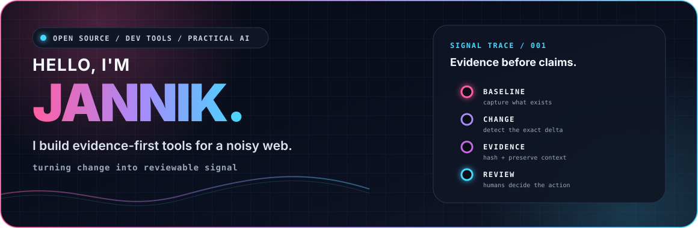
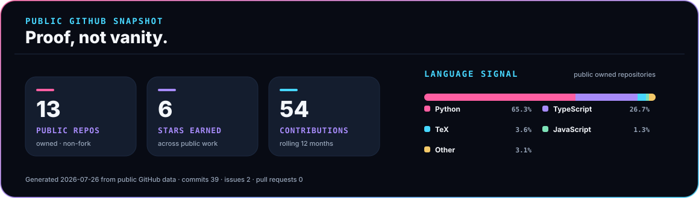
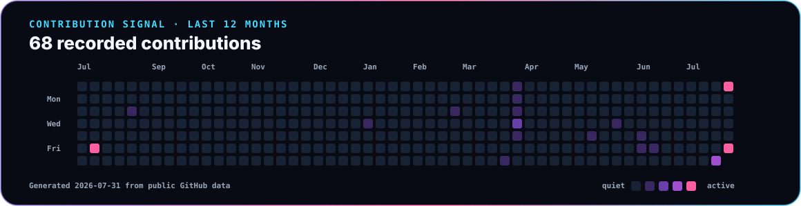

<p align="center">
  <picture>
    <source media="(max-width: 600px)" srcset="./assets/profile-header-mobile.svg" />
    
  </picture>
</p>

<p align="center">
  <a href="https://github.com/derprofi1313/signal-scout/releases/tag/v0.2.0"></a>
  <a href="https://github.com/derprofi1313/signal-scout/actions/workflows/ci.yml"></a>
  <a href="https://github.com/derprofi1313/signal-scout/actions/workflows/codeql.yml"></a>
</p>

## 🚀 About me

I build evidence-first developer tools and practical AI systems. My current
open-source focus is **Signal Scout**: a Git-native way to turn public-page
changes into reviewable evidence.

- I prefer a working vertical slice over a disconnected demo.
- I keep network and repository side effects explicit.
- I ship small releases with tests, reproducible artifacts, and honest limits.

> **Evidence before claims. Review before side effects.**

## 🛰️ Featured signal — [Signal Scout](https://github.com/derprofi1313/signal-scout)

Signal Scout captures a baseline, detects an exact change, and preserves the
result as a deterministic `signal-scout/evidence@1` packet. The same scanner
runs locally or as a first-party Node 24 GitHub Action:

```yaml
- uses: derprofi1313/signal-scout@v0.2.0
  with:
    config: signal-scout.config.json
```

- Exact before/after evidence with hashes and bounded metadata
- Caller-owned cache, artifacts, notifications, commits, and pull requests
- Reproducible Action bundle, CI, CodeQL, and desktop/mobile verification

[Action guide](https://github.com/derprofi1313/signal-scout#github-action)
· [v0.2.0 release](https://github.com/derprofi1313/signal-scout/releases/tag/v0.2.0)
· [Evidence schema](https://github.com/derprofi1313/signal-scout/blob/main/signal-scout.schema.json)

## Proof project — [Cash-Claw](https://github.com/derprofi1313/cash-claw)

Cash-Claw is a public MIT-licensed autonomous-agent project built on OpenClaw.
At inspection time on 2026-07-31, the repository showed 5 GitHub stars. I treat
it as proof of architecture and implementation surface, not a revenue claim.

- Local-first gateway with REST, WebSocket, and dashboard surfaces
- Operator setup for LLM providers, chat channels, Stripe, limits, and sandboxing
- Security docs covering loopback binding, auth tokens, redaction, and Docker isolation

[Repository](https://github.com/derprofi1313/cash-claw)
· [Security policy](https://github.com/derprofi1313/cash-claw/security/policy)
· [MIT license](https://github.com/derprofi1313/cash-claw/blob/main/LICENSE)

## More verified work

- [RepoPilot-OSS](https://github.com/derprofi1313/RepoPilot-OSS) — a TypeScript
  repository-analysis CLI with provider credential redaction, a real ESLint
  gate, Node 22/24 CI, and 253 passing tests.
- [Hermes Trading Sandbox](https://github.com/derprofi1313/hermes-trading-sandbox)
  — a Python paper-trading service with fail-closed LAN admin controls, pinned
  CI, and an honestly reported suite of 97 passing and 16 skipped tests.
- [OBLITERATUS GLM-5.2](https://github.com/derprofi1313/OBLITERATUS-glm52) —
  a clearly attributed maintained derivative of
  [elder-plinius/OBLITERATUS](https://github.com/elder-plinius/OBLITERATUS),
  with corrected CLI documentation and a CPU-safe CI gate.
- [macOS Malware Incident Evidence](https://github.com/derprofi1313/mac-malware-incident-2026-06-11)
  — an inert incident-response evidence set with a cryptographic manifest,
  non-executing integrity CI, publication limits, and safe-handling guidance.
- [Roblox Luau Service Examples](https://github.com/derprofi1313/My-code-examples)
  — server-authoritative gameplay modules with finite-value and target
  validation, exact-once async signal semantics, compile checks, and regression
  tests.
- [Desktop AI Agent 2](https://github.com/derprofi1313/Desktop-AI-Agent2) — a
  host-integrated React source snapshot with deterministic model-action
  validation, explicit side-effect confirmations, and a restrictive embedded
  browser policy.

## Contribution and contact

- Review project direction through [Signal Scout issues](https://github.com/derprofi1313/signal-scout/issues).
- Discuss Cash-Claw changes through [Cash-Claw issues](https://github.com/derprofi1313/cash-claw/issues).
- Reach me through my [GitHub profile](https://github.com/derprofi1313).

## 🧰 Working stack

<p>
  
  
  
  
  
  
  
  
  
  
</p>

## 📊 Public GitHub snapshot

<p align="center">
  <picture>
    <source media="(max-width: 600px)" srcset="./assets/profile-stats-mobile.svg" />
    
  </picture>
</p>

<sub>Generated weekly from the public GitHub GraphQL API by a tested,
repository-owned renderer — no profile-view counter and no third-party stats
card.</sub>

<!-- profile-data:start -->
**Current public snapshot:** 13 owned non-fork repositories · 6 stars · 54 contributions in the rolling 12 months. Generated 2026-07-27 from public GitHub data.
<!-- profile-data:end -->

## ▰ Contribution signal

<p align="center">
  <picture>
    <source media="(max-width: 600px)" srcset="./assets/contribution-signal-mobile.svg" />
    
  </picture>
</p>

<sub>The desktop view shows individual days; the mobile view groups the same
public activity by month for legibility. GitHub's native activity timeline
remains available below this README.</sub>

## 🧭 How I build

- **Source it:** preserve the input and distinguish verified facts from open work.
- **Bound it:** make permissions, network calls, and write operations visible.
- **Prove it:** test the real path and publish artifacts others can inspect.

<p align="center">
  <code>capture → hash → diff → review</code>
</p>
